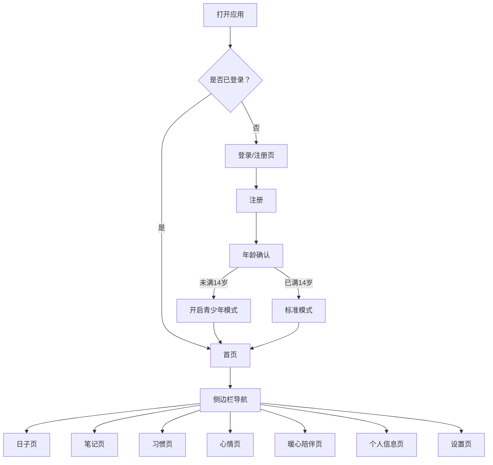

# 探时 - 产品需求文档 (PRD)

## 1. 产品概述

探时是一款温暖治愈的时间管理与生活记录Web应用，以淡黄色暖色调和液态玻璃拟态设计为特色，帮助用户记录生活中的重要时刻、培养良好习惯、追踪心情变化。应用提供青少年模式，为未成年用户提供AI暖心陪伴功能。

- 核心价值：让时间有温度，让记录有陪伴
- 目标用户：全年龄段用户，特别关注青少年心理健康
- 数据存储：全部数据本地化存储，保护用户隐私

## 2. 核心功能

### 2.1 用户角色

| 角色 | 注册方式 | 核心权限 |
|------|----------|----------|
| 普通用户 | 用户名+密码注册 | 使用所有基础功能（日子、笔记、习惯、心情） |
| 青少年用户 | 同上，年龄<14岁自动开启 | 基础功能 + AI暖心陪伴模块 |

### 2.2 功能模块

1. **登录注册系统**：用户认证、青少年模式自动判定
2. **首页**：问候语、快捷入口、数据概览
3. **日子模块**：纪念日、倒计日、过去日、倒计时、小倒数
4. **备忘录·笔记**：笔记、待办、灵感、生活四分类
5. **习惯养成**：每日打卡、连续天数、日历视图
6. **心情记录**：心情打卡、统计分析、热力图
7. **AI暖心陪伴**：多轮对话、关键词识别、快捷话题（仅青少年模式）
8. **个人信息页**：头像、账号信息、数据统计
9. **设置页**：模式切换、数据管理、退出登录

### 2.3 页面详情

| 页面名称 | 模块名称 | 功能描述 |
|----------|----------|----------|
| 登录/注册页 | 认证模块 | 用户名密码登录、注册、年龄确认、青少年模式提示 |
| 首页 | 首页模块 | 时间问候、快捷入口卡片、今日概览 |
| 日子页 | 日子模块 | 5种类型日子列表、添加/编辑/删除、倒计时控制 |
| 笔记页 | 笔记模块 | 四分类笔记、搜索、添加/编辑/删除、时间排序 |
| 习惯页 | 习惯模块 | 习惯列表、打卡操作、连续天数、日历热力图 |
| 心情页 | 心情模块 | 心情打卡、统计占比、30天热力图 |
| 暖心陪伴页 | AI陪伴模块 | 对话列表、消息发送、快捷话题、正在输入动画 |
| 个人信息页 | 用户模块 | 头像上传、账号信息展示、数据统计概览 |
| 设置页 | 设置模块 | 账号信息、模式切换、重置数据、退出登录 |

## 3. 核心流程

## 4. 用户界面设计

### 4.1 设计风格

- **整体风格**：液态玻璃拟态（Glass Morphism）
- **主题色调**：淡黄色暖色系（主色 #FFF8E7，辅助色 #FFE4B5，强调色 #FFA500）
- **字体**：衬线字体（Georgia / "Noto Serif SC" / 宋体），宽松排版
- **卡片样式**：半透明白色背景 + 模糊效果 + 细边框 + 柔和阴影
- **动效**：卡片悬浮上浮、模态框弹跳进入、流畅过渡动画
- **图标风格**：Lucide 线性图标，配合 Emoji 表情

### 4.2 页面设计概览

| 页面名称 | 模块名称 | UI元素 |
|----------|----------|--------|
| 登录/注册页 | 认证模块 | 玻璃拟态表单卡片、暖黄渐变背景、弹跳动画模态框 |
| 首页 | 首页模块 | 大号问候语、四个快捷入口卡片、今日数据概览 |
| 日子页 | 日子模块 | 类型标签切换、卡片列表、添加按钮浮动在右下角 |
| 笔记页 | 笔记模块 | 四分类标签、搜索框、瀑布流/列表卡片 |
| 习惯页 | 习惯模块 | Emoji图标习惯卡片、打卡按钮、月历视图 |
| 心情页 | 心情模块 | 三个心情大按钮、统计饼图、30天热力图 |
| 暖心陪伴页 | AI陪伴模块 | 左侧对话列表、右侧聊天区域、底部快捷话题 |
| 个人信息页 | 用户模块 | 大圆头像、信息列表、统计卡片网格 |
| 设置页 | 设置模块 | 分组列表项、开关组件、确认对话框 |

### 4.3 响应式

- 桌面端（>1024px）：左侧固定侧边栏 + 右侧内容区
- 平板端（768-1024px）：可折叠侧边栏
- 移动端（<768px）：底部Tab导航 + 顶部标题栏

### 4.4 青少年模式专属设计

- 更柔和的暖橙色调
- 更大的字体和间距
- AI暖心陪伴模块入口高亮显示
- 界面元素更加圆润可爱
