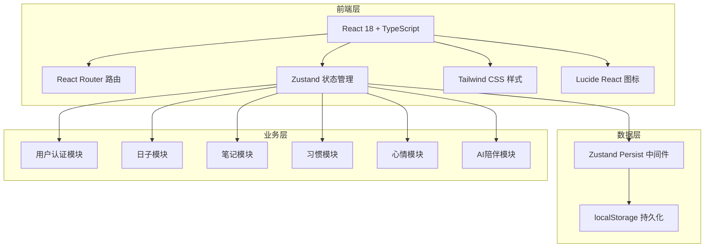
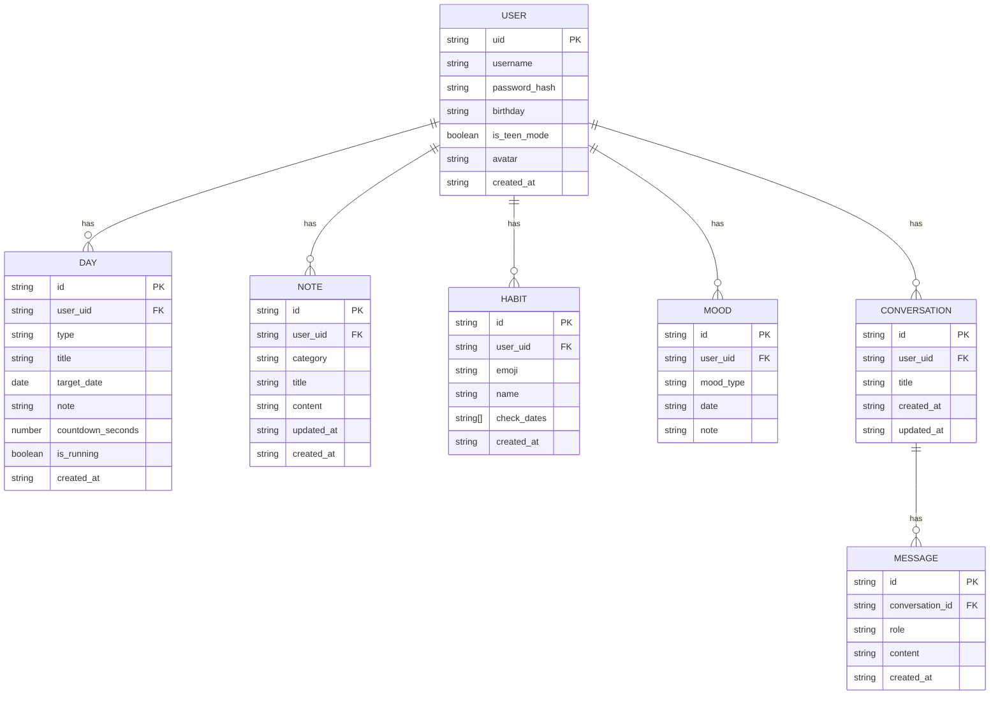

# 探时 - 技术架构文档

## 1. 架构设计



## 2. 技术描述

- **前端框架**：React 18 + TypeScript
- **构建工具**：Vite 5
- **路由管理**：React Router DOM 6
- **状态管理**：Zustand 4 + persist 中间件
- **样式方案**：Tailwind CSS 3
- **图标库**：Lucide React
- **数据存储**：localStorage（用户数据按UID隔离）
- **后端**：无（纯前端应用，数据本地存储）

## 3. 路由定义

| 路由路径 | 页面组件 | 权限要求 | 说明 |
|----------|----------|----------|------|
| `/login` | LoginPage | 未登录 | 登录页 |
| `/register` | RegisterPage | 未登录 | 注册页 |
| `/` | HomePage | 已登录 | 首页 |
| `/days` | DaysPage | 已登录 | 日子页 |
| `/notes` | NotesPage | 已登录 | 笔记页 |
| `/habits` | HabitsPage | 已登录 | 习惯页 |
| `/mood` | MoodPage | 已登录 | 心情页 |
| `/companion` | CompanionPage | 已登录 + 青少年模式 | AI暖心陪伴 |
| `/profile` | ProfilePage | 已登录 | 个人信息页 |
| `/settings` | SettingsPage | 已登录 | 设置页 |

## 4. 数据模型

### 4.1 数据模型定义



### 4.2 Zustand Store 结构

```typescript
// auth store - 用户认证
interface AuthState {
  currentUser: User | null;
  users: User[];
  login: (username: string, password: string) => boolean;
  register: (username: string, password: string, birthday: string) => boolean;
  logout: () => void;
  updateUser: (updates: Partial<User>) => void;
  toggleTeenMode: () => void;
}

// days store - 日子模块
interface DaysState {
  days: Day[];
  addDay: (day: Omit<Day, 'id' | 'created_at'>) => void;
  deleteDay: (id: string) => void;
  updateDay: (id: string, updates: Partial<Day>) => void;
}

// notes store - 笔记模块
interface NotesState {
  notes: Note[];
  addNote: (note: Omit<Note, 'id' | 'created_at' | 'updated_at'>) => void;
  deleteNote: (id: string) => void;
  updateNote: (id: string, updates: Partial<Note>) => void;
  searchNotes: (keyword: string) => Note[];
}

// habits store - 习惯模块
interface HabitsState {
  habits: Habit[];
  addHabit: (habit: Omit<Habit, 'id' | 'created_at' | 'check_dates'>) => void;
  deleteHabit: (id: string) => void;
  toggleCheck: (id: string, date: string) => void;
}

// mood store - 心情模块
interface MoodState {
  moods: Mood[];
  addMood: (mood: Omit<Mood, 'id'>) => void;
  getMoodStats: () => { good: number; normal: number; bad: number };
  getMoodHeatmap: (days: number) => Mood[];
}

// companion store - AI陪伴模块
interface CompanionState {
  conversations: Conversation[];
  currentConversationId: string | null;
  createConversation: () => string;
  deleteConversation: (id: string) => void;
  sendMessage: (content: string) => void;
}
```

## 5. 项目目录结构

```
src/
├── components/          # 公共组件
│   ├── Layout/         # 布局组件
│   │   ├── Sidebar.tsx
│   │   ├── Header.tsx
│   │   └── Layout.tsx
│   ├── ui/             # UI基础组件
│   │   ├── GlassCard.tsx
│   │   ├── Modal.tsx
│   │   ├── Button.tsx
│   │   └── Input.tsx
│   └── common/         # 业务公共组件
├── pages/              # 页面组件
│   ├── Login.tsx
│   ├── Register.tsx
│   ├── Home.tsx
│   ├── Days.tsx
│   ├── Notes.tsx
│   ├── Habits.tsx
│   ├── Mood.tsx
│   ├── Companion.tsx
│   ├── Profile.tsx
│   └── Settings.tsx
├── store/              # Zustand状态管理
│   ├── useAuthStore.ts
│   ├── useDaysStore.ts
│   ├── useNotesStore.ts
│   ├── useHabitsStore.ts
│   ├── useMoodStore.ts
│   └── useCompanionStore.ts
├── types/              # TypeScript类型定义
│   └── index.ts
├── utils/              # 工具函数
│   ├── date.ts
│   ├── storage.ts
│   └── aiResponse.ts
├── hooks/              # 自定义Hooks
├── App.tsx
├── main.tsx
└── index.css
```
